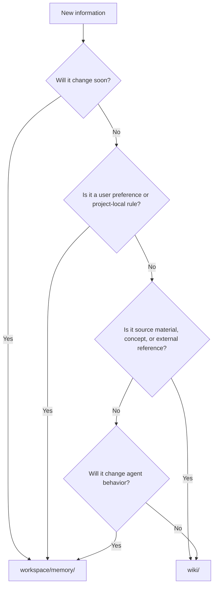

# Memory vs Wiki

## Directory

- [Decision Rule](#decision-rule)
- [Decision Diagram](#decision-diagram)
- [Examples](#examples)
- [Move Commands](#move-commands)
- [Merge Log](#merge-log)

## Decision Rule

- Use memory for information that may expire, depends on the user, or affects future agent behavior.
- Use wiki for stable facts, references, source notes, concepts, and durable knowledge artifacts.

## Decision Diagram



## Examples

| Item | Destination | Reason |
|---|---|---|
| User prefers concise Chinese replies | memory | User preference affects behavior |
| PostgreSQL default port 5432 | wiki | Stable general fact |
| This project uses port 8765 | memory | Project-local and may change |
| A downloaded research paper summary | wiki | Source/reference artifact |
| Current sprint goal | memory | Temporary context |
| Company glossary definition | wiki | Stable concept |
| API key location hint | memory | Local operational hint; never store secret |
| Meeting decision from last week | memory | Future behavior context |
| Python dataclass syntax note | wiki | General knowledge |
| Repeated bug-fix SOP | memory | Agent workflow rule |

## Move Commands

```bash
iron memory move-to-wiki . workspace/memory/short-term/example.md --slug example
iron wiki move-to-memory . wiki/concepts/example.md --target workspace/memory/semantic/example.md
```

Both commands write a reversible log to `workspace/meta/wiki-memory-moves.jsonl`.

## Merge Log

The Web UI Settings page shows recent entries as `merged`, `separated`, or `moved`.
